# Fact-checking相关的文献地图

## CofCED

标题：A Coarse-to-fine Cascaded Evidence-Distillation Neural Network for
Explainable Fake News Detection
链接: https://aclanthology.org/2022.coling-1.230.pdf

### 主要工作

构建了一套级联选择器，将原始的report经过多层编码得到各种级别的表示，然后将所有特征，包括claim同一拼接后交给MLP分类。
提出了LIAR-RAW以及RAWFC两个数据集

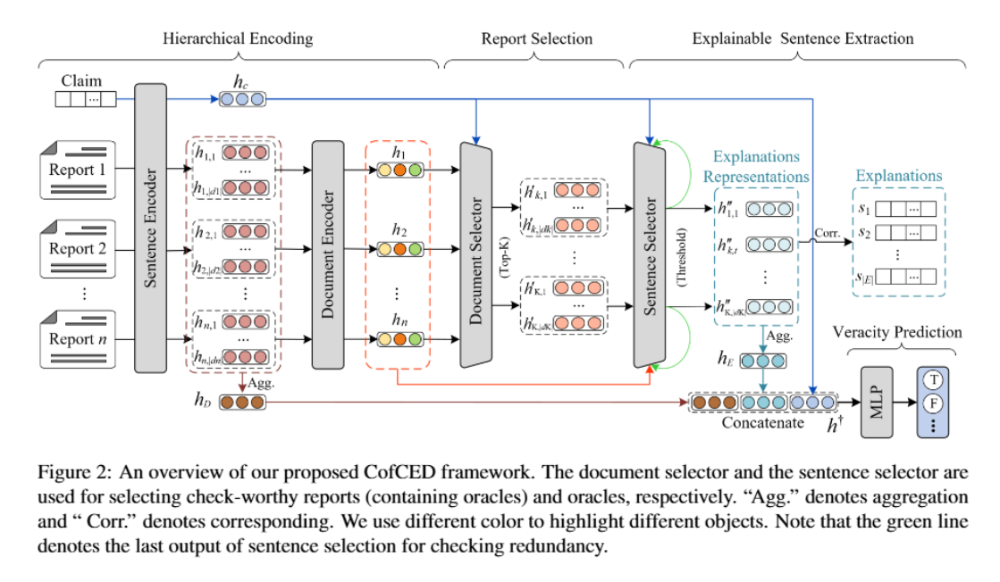

## L-Defense

标题：Explainable Fake News Detection With Large Language Model via Defense Among Competing Wisdom
链接: https://openreview.net/pdf?id=WurgtxoLt3

### 主要工作

利用群体智慧，将evidence单元分为正反两方，并使用LLM为正反两方都生成辩护，将两方辩护做成特征交给分类器得到最终结果，文章假设事实正确的一方会压过错误的一方从而得到正确结果。

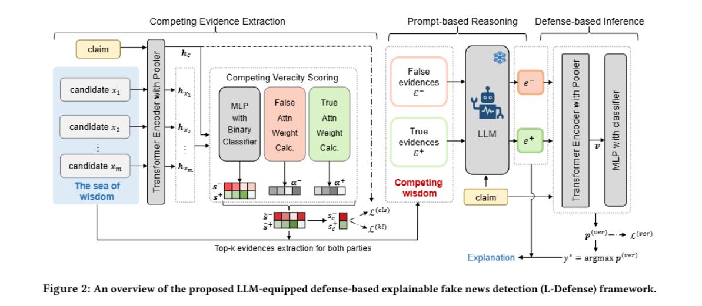

## G-Defense

标题：A Graph-Enhanced Defense Framework for Explainable Fake News Detection with LLM
链接: https://arxiv.org/pdf/2604.06666

### 主要工作

可以认为是L-defense的升级版，
1）利用LLM将claim分解成了sub-claim，同时又用LLM为每个sub-claim标注了结构边
2）为每个sub-claim检索证据，然后用LLM为其生成正反辩护
3）将整个图序列化后交给分类器分类标签，得到标签后还把序列化后的图同时交给LLM生成解释

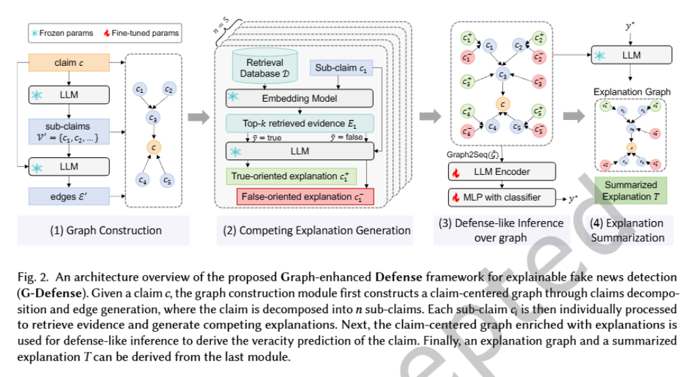

## FactLLaMA

标题：FactLLaMA: Optimizing Instruction-Following Language Models with External Knowledge for Automated Fact-Checking
链接：https://arxiv.org/pdf/2309.00240

### 主要工作

使用了目前看来比较基础的流程：1）RAG检索证据；2）prompt微调LLM输出

## DeReC

标题：Whenretrieval outperforms generation: Dense evidence retrieval for scalable fake news detection
链接：https://aclanthology.org/2025.ldk-1.26.pdf

### 主要工作

同样使用RAG的思想检索证据，并按照以下方式拼接证据：
\[\begin{equation*}
x=[\mathrm{CLS}] ; c ;[\mathrm{SEP}] ; e_{1} ;[\mathrm{SEP}] ; \ldots ;[\mathrm{SEP}] ; e_{k} ;[\mathrm{SEP}] \tag{4}
\end{equation*}\]
而后交给DeBERTa- v3-large完成后续分类，没有使用LLM

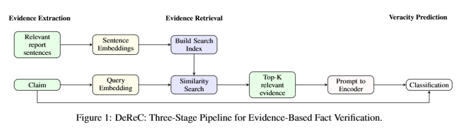

## FFRR

标题：Reinforcement Retrieval Leveraging Fine-grained Feedback for Fact Checking News Claims with Black-Box LLM
链接: https://aclanthology.org/2024.lrec-main.1209.pdf

### 主要工作

基本框架是：1）claim分解成问题；2）为每个问题检索证据；3）LLM训练/推理。但是创新点在于该文章用 LLM 当作打分器，用强化学习策略把打分器的反馈更新到检索器上，使其选择更有利于分类正确的证据。同时，这一策略还会作用于问题分解后的检索上。

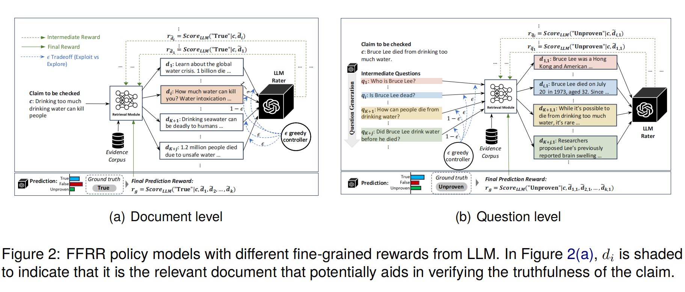

## DelphiAgent

标题：DelphiAgent: A trustworthy multi-agent verification framework for automated fact verification

### 主要工作

构建了一套用于事实核查的agent系统，由agents完成report到enidence的解析/验证工作，而后再用agents从不同角度分析evidence并合并总结，最后输出结果。

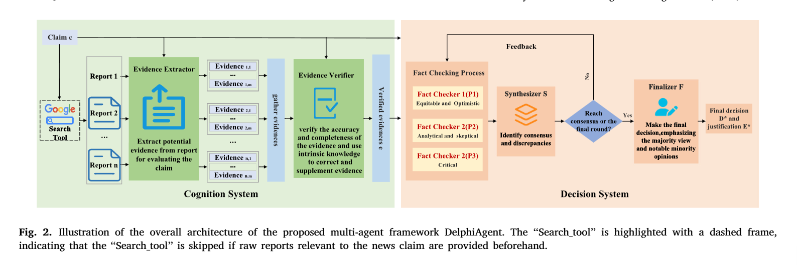

## KG-CRAFT

标题：KG-CRAFT: Knowledge Graph-based Contrastive Reasoning with LLMs for Enhancing Automated Fact-checking
链接：https://aclanthology.org/2026.eacl-long.302.pdf

### 主要工作

文章将report分解成一个细粒度的知识图谱，包含各种实体以及关系表示，然后再图中抽取同类别实体与关系构建对比问题，让模型完成问答，将所有问答总结成最后模型的判别依据。

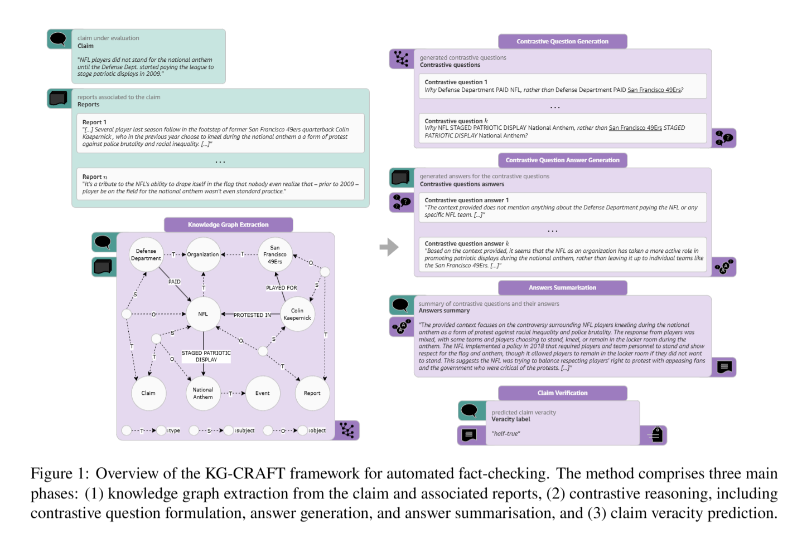

## HiSS

标题：Towards LLM-based Fact Verification on News Claims with a Hierarchical Step-by-Step Prompting Method
链接：https://aclanthology.org/2023.ijcnlp-main.64.pdf

### 主要工作

文章将事实核查做成一个基于LLM的step by step过程，具体流程为：
1）claim分解成子claim；
2）让模型针对子claim问答，并添加手工prompt询问模型是否有足够信心回答，若信心不够，则允许联网搜索问题；
3）完成所有子claim的解答后，让模型输出最终答案

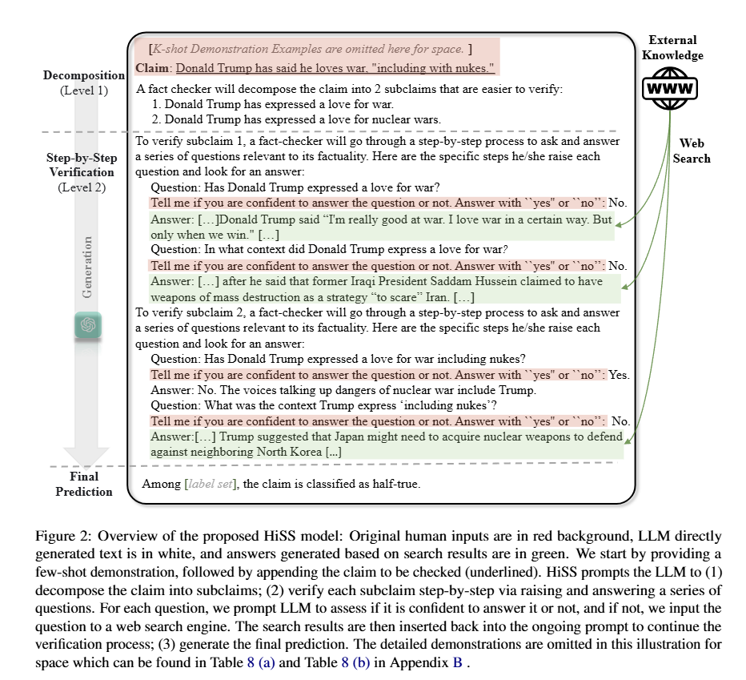

## RAFTS

标题：LinguisticsRetrieval Augmented Fact Verification by Synthesizing Contrastive Arguments

### 主要工作

主体逻辑与L-defense相似，
1）为claim检索相关的证据；
2）让LLM写出支持以及反驳理由；
3）把检索出的可解释证据以及支持/反驳文本一并交给LLM，并给出一些示例做ICL

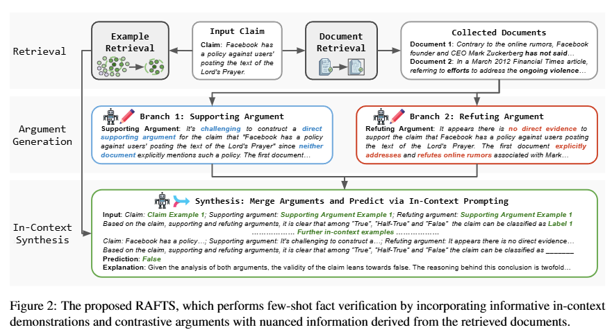

## EVICheck

标题：EVICheck: Evidence-Driven Independent Reasoning and Combined Verification Method for Fact-Checking

### 主要工作

主要流程为：
1）生成子问题；
2）选择最优问题后让LLM推理，以此循环，由计数器限制次数；
3）把多轮问题验证信息都给LLM微调

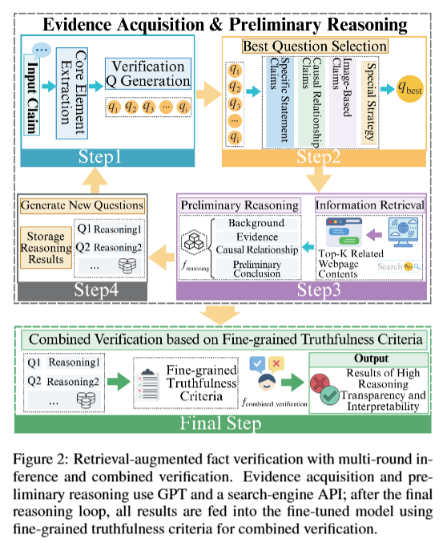

## FEVER

标题：FEVER: a large-scale dataset for Fact Extraction and VERification

### 主要工作

该文章提出了FEVER数据集，主要由claim + evidence组成，其中全部由纯文本句子构成，标签要求Supported、Refuted 以及 NotEnoughInfo，总数约18w条

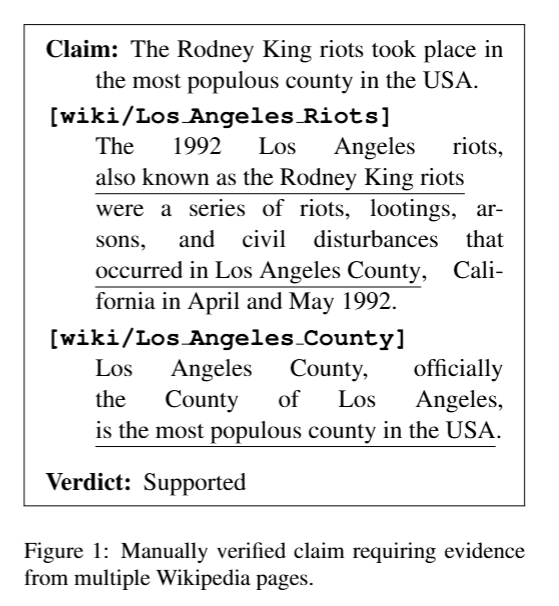

## FEVEROUS

标题：The Fact Extraction and VERification Over Unstructured and Structured
information (FEVEROUS) Shared Task

### 主要工作

该文章提出了FEVEROUS数据集，其中证据单元包括纯文本句子、纯表格单元格，以及两者的混合，而标签与LIAR-RAW与RAWFC不同，要求Supported、Refuted 以及 NotEnoughInfo

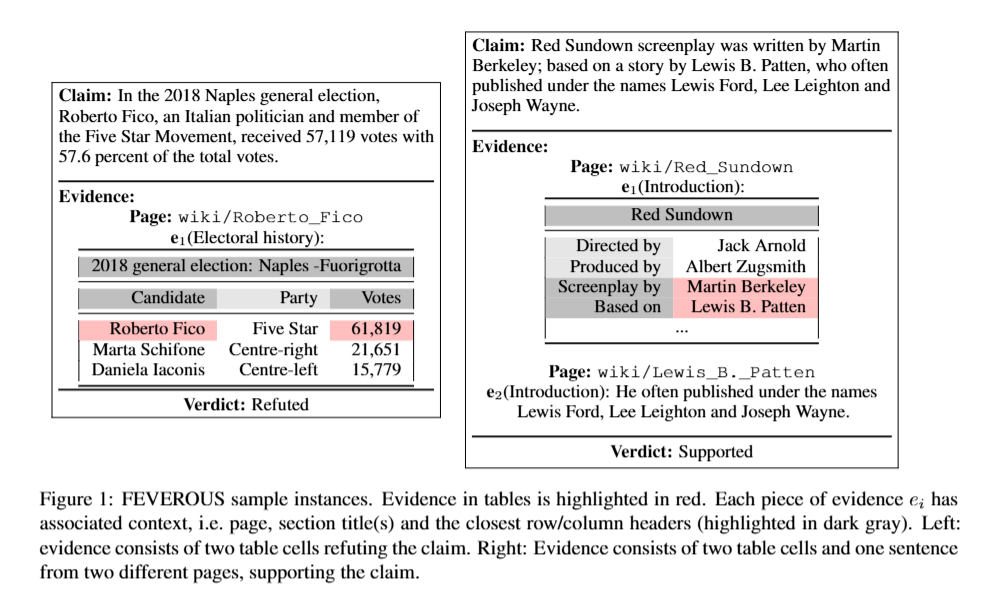

## AVerITeC

标题：AVeriTeC: A Dataset for Real-world Claim Verification with Evidence from the Web

### 主要工作

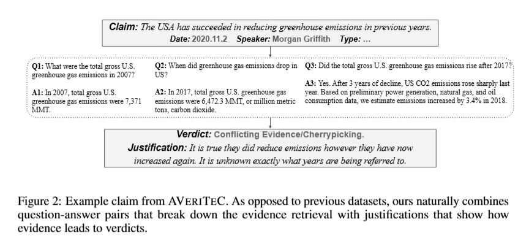

该文章提出了一个新的数据集，不同于以往的claim + evidence形式，该数据集为claim提供一个问答对，输出包含标签以及解释文本，其中标签包含：
Supported（支持） — 声明被证据支持
Refuted（反驳） — 声明被证据反驳
Not enough evidence（证据不足） — 没有足够证据来判断
Conflicting evidence/cherry-picking（冲突证据/挑选证据） — 这是该数据集新增的第四类，涵盖证据相互冲突的情况，以及技术上真实但通过遗漏重要背景而误导的声明

## HoVer

标题：HoVer: A Dataset for Many-Hop Fact Extraction And Claim Verification

### 主要工作

主要聚焦于多跳证据提取和事实验证，数据也包含claim + 相关文档，标签包含Supported、Refuted或 NotEnoughInfo

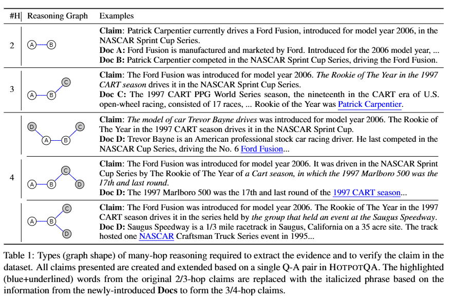

